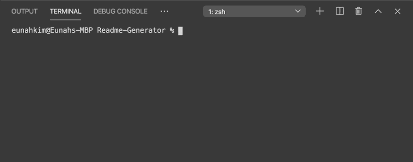

  # Readme-Generator

  [](https://github.com/eunahk92/Readme-Generator)

  ## Description
  A command-line application using node that dynamically generates a README file from user's input.

  ## User Story
  ```
  AS A developer
  I WANT to easily create readme.md files
  SO THAT it saves other developer's times when writing readme's
  ```
  
  ## Table of Contents
  * [Installation](#installation)
  * [Usage](#usage)
  * [Tests](#tests)
  * [Contribution](#contribution)
  * [License](#license)
  * [Questions](#questions)
  
  ## Installation
  ```
  npm i
  ```
  
  ## Usage
  Must know: their Github info

  Run the index.js file using node from your command line and fill in your project's details in their respective spots.

  

  When successfully finished, you will receive a message and your new README.MD file has been created.

  
  
  ## Tests
  ```
  npm test
  ```

  ## Contribution
  Email me
  
  ## License
  MIT

  ## Questions
  If you have any questions about the repo, open an issue or contact [Eunahk92](https://github.com/eunahk92) directly at Eunahkim92@gmail.com.

  